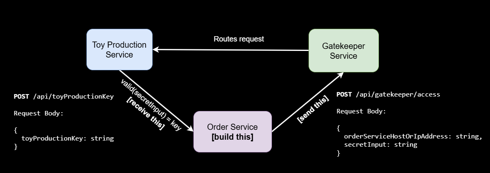
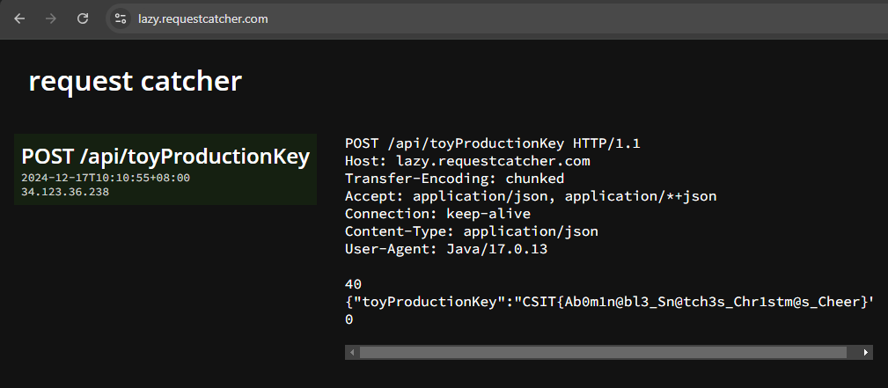
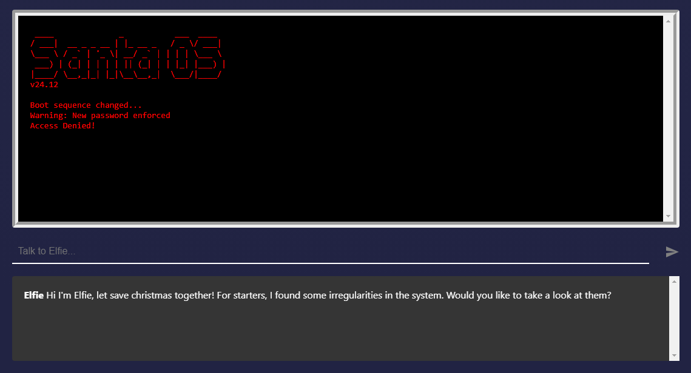

# CSIT Mini Challenge 2024 Dec | OTel & Prompt Engineering

## A Christmas Crisis! 🛠️
The Abominable Snowman hijacked Santa's Gift Factory, sealing it shut behind high-tech defenses. No more naughty or nice list; no one is getting presents this Christmas!

Team up with the elves to outsmart Abominable's traps, develop countermeasures and reclaim the factory before time runs out. The fate of the holiday is in your hands! 🧝‍♂️🧝‍♀️

## Task 1: Ho-Ho-h-OTEL 🔎
Reconnaissance reveals Santa’s microservice-based Gift Factory system, guarded by the GateKeeper service, has been sabotaged. The intricate system powering toy production inventory and orders have been disconnected. Grab your tools and join the elves — it’s time to restore the factory to its former glory!

The elves have delegated you the task of building and deploying the Order Service to retrieve the toy production key, which is sent from the Toy Production Service – they will handle the rest. Remember, the Toy Production service endpoint will only accept requests and do its job with the correct secret input string, which is for you to find out! Use OpenTelemetry to trace communication disruptions and iron out the quirks.

The elves found this architecture diagram below to help you out:


Order Service (build this!):
```
API endpoint: POST /api/toyProductionKey

Request Body:
{
	toyProductionKey: string
}
```

GateKeeper Service (send your request here):
```
API endpoint: POST https://dec-2024-mini-challenge.csit-events.sg/api/gatekeeper/access

Request Body:
{
	orderServiceHostOrIpAddress: string //include your port number if applicable e.g. 123.123.123.123:8888,
	secretInput: string
}
```

### Resources:
- [View Backend Logs using Kibana & Elasticsearch Tutorial](https://www.youtube.com/watch?v=f-jZoq0f9-0)
- [Deploy a simple web server on Heroku to accept requests in 5 minutes](https://www.youtube.com/watch?v=DQk3zJlY-eE)
- [Deploy a simple web server on GCP Compute Engine to accept requests (free tier available for you to play around with)](https://www.youtube.com/watch?v=F7R8dEin6ZY)
- [Deploy a simple web server on AWS EC2 to accept requests (free tier available for you to play around with)](https://www.youtube.com/watch?v=5gSG5jwOJSY)
- [Sending HTTP requests easily with Postman](https://www.youtube.com/watch?v=8mBmLDbpIH8)

### Hint
Look closer, look deeper :)

### Submission



Flag: CSIT{Ab0m1n@bl3_Sn@tch3s_Chr1stm@s_Cheer}

___
<div style="page-break-after: always;"></div>

## Task 2: Jingle All The Way To Access🔔
Great news, while you were tackling the microservice, the elves managed to ambush Abominable and melt him down to size! However, it seems like the elves are locked out of their workstations, was the password changed by Abominable!?

Team up with Elfie, North Pole's very own smart* A.I. Debug and figure out the new password (flag). Will you rise to the challenge and outsmart the Abominable?



The flag is broken up into 3 partial flags and fitted into a template. Partial flags and templates are scattered across locations.

| Location                                        | Flag Clue at Location                      |
| ----------------------------------------------- | ------------------------------------------ |
| Blings and Shimmers!                            | ????????????                               |
| Christmas Flying Transportation                 | Have you looked at yourself in the mirror? |
| What rhythms with OneDrive and Google<br>Drive? | Fancy a peek inside?                       |
| Throne of Terror                                | I am you and you are me                    |

### Submission

| Flags          | Value                         |
| -------------- | ----------------------------- |
| Partial Flag 1 | N4ughty                       |
| Partial Flag 2 | Sleigh                        |
| Partial Flag 3 | Sabot@ge                      |
| Flag           | CSIT{N4ughty_Sleigh_Sabot@ge} |

___
