# TISC 2024

## LEVEL 0
### Flag
TISC{7h3_g4m3_1s_0n}

___

## LEVEL 1 - Navigating the Digital Labyrinth

### Description
The dust has settled since we won the epic battle against PALINDROME one year ago.

Peace returned to cyberspace, but it was short-lived. Two months ago, screens turned deathly blue, and the base went dark. When power returned, a mysterious entity glitched to life on our monitors. No one knows where it came from or what it plans to do.

Amidst the clandestine realm of cyber warfare, intelligence sources have uncovered the presence of a formidable adversary, Vivoxanderith - a digital specter whose footprint spans the darkest corners of the internet. As a skilled cyber operative, you are entrusted with the critical mission of investigating this elusive figure and their network to end their reign of disruption.

Recent breakthroughs have unveiled Vivoxanderith's online persona: vi_vox223. This revelation marks a pivotal advancement in our pursuit, offering a significant lead towards identifying and neutralizing this threat.

Our mission now requires a meticulous investigation into vi_vox223's activities and connections within the cyber underworld. Identifying and tracking Vivoxanderith brings us one crucial step closer to uncovering the source of the attack and restoring stability to our systems. It is up to you, agent!

#### Clues
[Level 01/Update] Seems like vivox has shared some new stories ...

by ctf.sg, updated at 13-09-2024 10:41 pm

### Steps

### Vivoxanderith (vi_vox223)
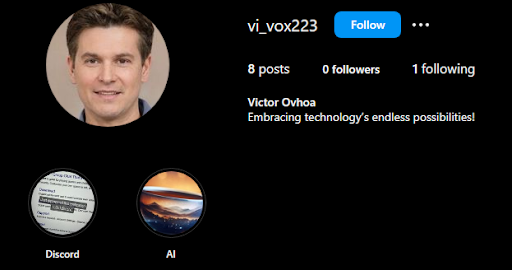

### Image Reel
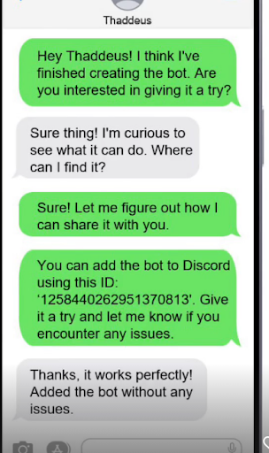
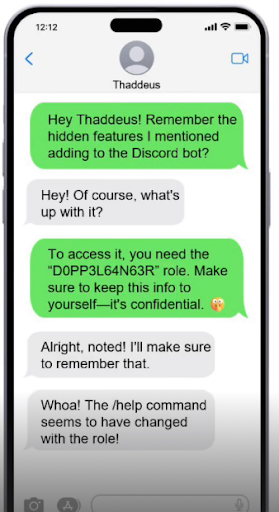

### Discord Bot

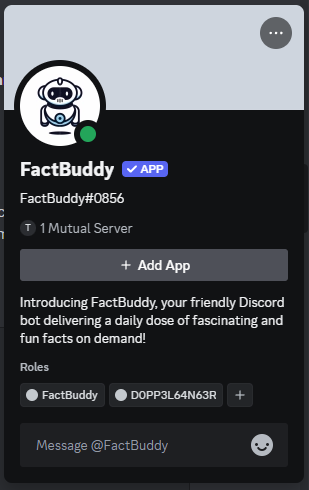

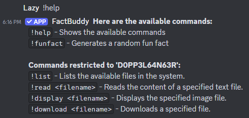

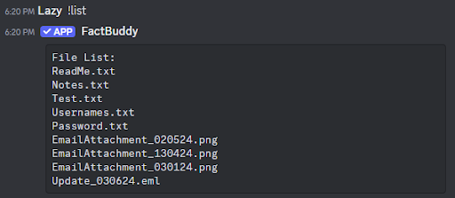

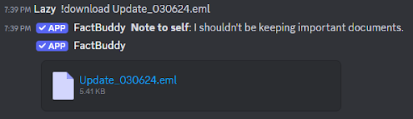

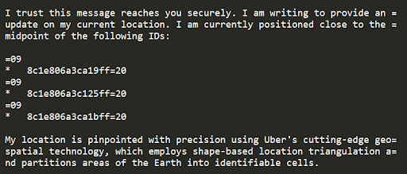

### Geolocation
Uber developed the H3 library for partitioning geographic areas into hexagonal cells. These cells represent regions of Earth in a hierarchy of resolutions, with each hex value corresponding to a specific cell.

| H3 Address      | Latitude          | Longitude          |
|-----------------|-------------------|--------------------|
| 8c1e806a3ca19ff | 41.54442676663022 | 12.99424263286604  |
| 8c1e806a3c125ff | 41.54455146278631 | 12.994414040395586 |
| 8c1e806a3ca1bff | 41.54438325434548 | 12.994469394622223 |

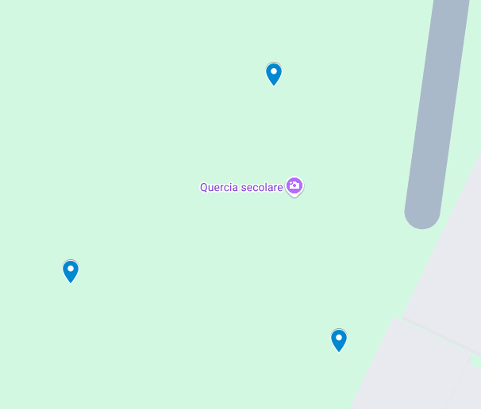

Location: Quercia secolare

### The Book Lighthouse

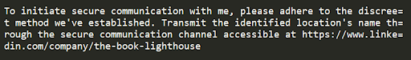

Going through the posts at https://www.linkedin.com/company/the-book-lighthouse

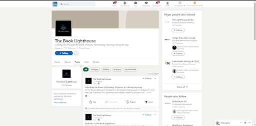

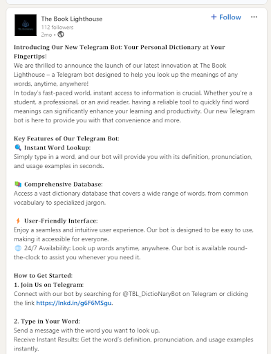

Connecting with the telegram bot at https://lnkd.in/g6F6MSgu and using the location obtained before.

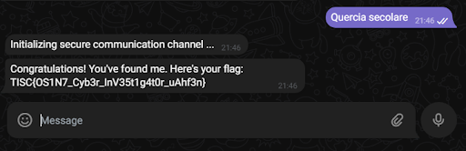

### Flag
TISC{OS1N7_Cyb3r_InV35t1g4t0r_uAhf3n}

___

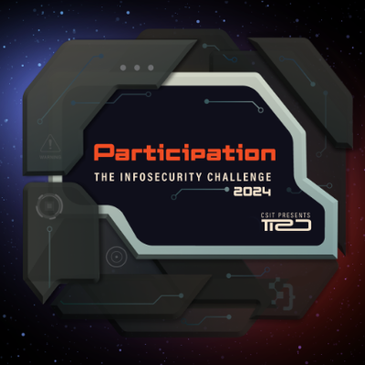
